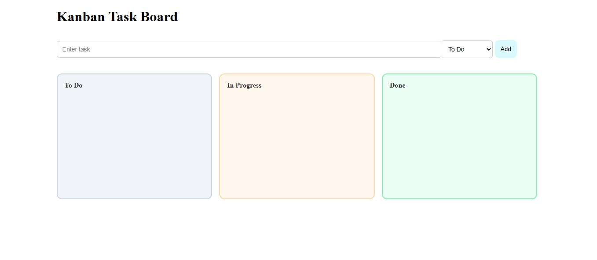
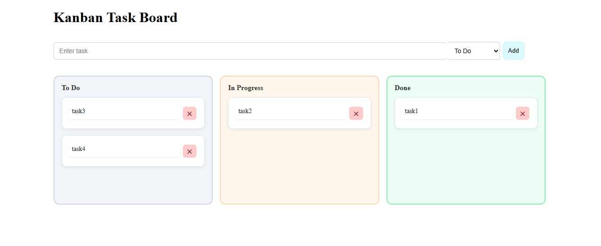

# Kanban Task Board

A Trello-like Kanban Task Board built with React, TypeScript, and Vite.
## Versel Deploy link
[vercel](https://kanban-task-cc67.vercel.app/)



## Project Goal

This project demonstrates React component patterns, state management (`useState`), props, and progressively adds polish and professional features (editing, priority, persistence, drag-and-drop, and filtering).

## Features (by difficulty)

- **Level 1 — Core Logic (required)**
	- Create project with Vite.
	- Three columns: To Do, In Progress, Done.
	- Add Task (input): creates card in To Do.
	- Delete Task: `X` button on each card.
	- Move Task: simple buttons to move between columns.

- **Level 2 — Polish (recommended)**
	- Inline Editing: click task text to edit and save.
	- Priority: dropdown when creating tasks (High / Medium / Low).
		- High → red border, Medium → yellow border, Low → green border.
	- Persistence: save tasks to `localStorage` so they survive refresh.

- **Level 3 — Professional (optional)**
	- Drag & Drop: integrate `dnd-kit` or `react-beautiful-dnd` to drag cards between columns.
	- Smooth interactions and accessibility improvements.
	- Filter / Search bar to filter tasks by title.

## Quick Start

1. Install dependencies

```bash
npm install
```

2. Run development server

```bash
npm run dev
```

3. Build for production

```bash
npm run build
```

4. Preview production build

```bash
npm run preview
```

## Project Structure (important files)

```
public/
	└─ screenshot.png   # add your screenshot here
src/
	├─ components/
	|   ├─ DraggableTask.tsx
	|   └─ DroppableContainer.tsx
	├─ App.tsx
	├─ main.tsx
	└─ index.css
index.html
package.json
vite.config.ts
tsconfig.json
eslint.config.js
```

## Implementation Notes

- State: use `useState` for task lists; consider structuring tasks as objects { id, title, column, priority }.
- Persistence: use `localStorage` (serialize with `JSON.stringify`) and initialize state from it on app load.
- Editing: toggle an `isEditing` mode per task and render an `<input>` when active.
- Priority styling: apply border color classes based on the task's priority.



## Libraries and Recommendations

- For drag-and-drop, `dnd-kit` is modern and lightweight; `react-beautiful-dnd` is feature-rich but heavier.
- Keep components small and focused: e.g., `DraggableTask` (single card) and `DroppableContainer` (column).


## App link
[vercel](https://kanban-task-cc67.vercel.app/)